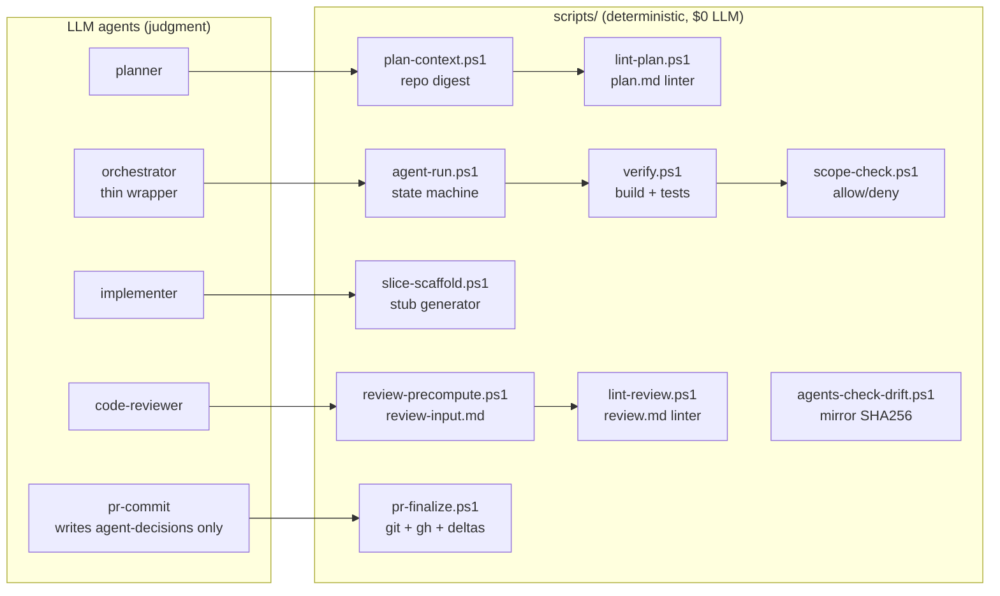

# BookSlot agentic workflow — quickstart

This repo ships with a 5-stage agentic pipeline plus two **mandatory Human-in-the-Loop (HITL)** checkpoints. The orchestrator never auto-approves on your behalf.

```
prompt → planner → ⏸ HITL #1 ⏸ → implementer ↔ verifier (≤3) → code-reviewer → ⏸ HITL #2 ⏸ → pr-commit → PR
```

## File layout

The pipeline ships **two parallel mirror sets** of agent definitions — one per host platform. The body (system prompt) of each pair is bit-identical; only the YAML frontmatter differs (different field names, tool ids, model selectors).

```
.github/
├── copilot-instructions.md          # repo conventions (VSA, Result<T>, tenant scope, ...)
├── AGENTS.md                        # ← you are here
└── agents/                          # ── GitHub Copilot mirror (.agent.md convention)
    ├── _shared/
    │   ├── repo-context.md          # invariants + scope-allow + tool-name mapping (§9), loaded by every agent
    │   └── max-iterations.md        # iteration guard policy
    ├── orchestrator.agent.md        # user-invocable; agents: [planner, ...]
    ├── planner.agent.md             # handoffs → implementer
    ├── implementer.agent.md         # handoffs → verifier
    ├── verifier.agent.md            # handoffs → code-reviewer / implementer
    ├── code-reviewer.agent.md       # handoffs → pr-commit / implementer
    └── pr-commit.agent.md

.claude/agents/                      # ── Claude Code mirror (Claude-native frontmatter)
├── orchestrator.md                  # tools: Agent(planner, ...), Read, Grep, Bash
├── planner.md                       # permissionMode: plan, maxTurns: 8
├── implementer.md                   # maxTurns: 30
├── verifier.md                      # tools: Read, Grep, Bash
├── code-reviewer.md                 # permissionMode: plan, maxTurns: 10
└── pr-commit.md                     # tools: Read, Grep, Edit, Bash

scripts/
└── agents-check-drift.ps1           # SHA256-compares bodies between the two mirrors

docs/
└── agent-decisions.md               # long-term memory: human corrections become future rules
```

## Run artifacts

Every run writes to `./.agent-run/<run-id>/` (gitignored):

```
./.agent-run/2026-04-26T20-30-00-staff-add-note/
├── prompt.md
├── plan.md                # planner output
├── plan.approved.md       # ← you write this in HITL #1
├── implementation/
│   ├── summary.md
│   └── diff.patch
├── verify-report.md
├── review.md              # code-reviewer output
├── review.approved.md     # ← you write this in HITL #2
├── pr-body.md
└── state.json
```

Only `docs/agent-decisions.md` and the feature code are committed; the run folder is local.

## Running on Claude Code vs GitHub Copilot

The same pipeline works on both platforms — pick the mirror your client reads from.

|                            | **Claude Code** (`.claude/agents/`)                                   | **GitHub Copilot** (`.github/agents/*.agent.md`)                |
|----------------------------|------------------------------------------------------------------------|------------------------------------------------------------------|
| Source folder              | `.claude/agents/<name>.md`                                             | `.github/agents/<name>.agent.md`                                 |
| Tool ids                   | `Read, Grep, Glob, Edit, Write, Bash, WebFetch, Task, Agent(name,…)`   | `codebase, search, editFiles, runCommands, fetch, agent`         |
| Model selector             | `model: inherit` / `sonnet` / `opus` / `haiku` / full id               | `model: GPT-5.2 (copilot)` (or priority list `[A, B]`)           |
| Iteration cap              | `maxTurns: N` (native frontmatter)                                     | enforced via prompt rules in body (no native field)              |
| Read-only mode             | `permissionMode: plan` (planner, code-reviewer)                        | enforced via tool allowlist + body rules                         |
| Subagent invocation        | `Task` tool + `Agent(planner, …)` allowlist on orchestrator            | `agents: [planner, …]` field + `agent` tool                      |
| HITL flow                  | Pipeline stops; you edit `*.approved.md` artifact, then resume         | Same — plus per-agent `handoffs:` buttons surface gates as UI    |
| User-visible vs subagent   | every agent invocable                                                  | `user-invocable: true` only on orchestrator + planner            |

Fields like `scope_allow`, `max_iterations`, `timeout_minutes`, `hitl` are **not natively supported on either platform** — they live in the body of every agent (`## Twarde zasady` / `Hard rules`) and are enforced via prompt instructions, not the runtime.

### Drift control

When you edit an agent, edit **both** mirrors. To verify they match:

```powershell
pwsh ./scripts/agents-check-drift.ps1
```

The script compares the SHA256 of each pair's body (everything after the second `---`). Frontmatters intentionally differ; bodies must not. Run before every commit that touches `.github/agents/*.agent.md` or `.claude/agents/*.md`.

## Running the pipeline

> The pipeline is designed for [Claude Code](https://docs.anthropic.com/en/docs/claude-code) subagents and [GitHub Copilot custom agents](https://code.visualstudio.com/docs/copilot/customization/custom-agents). Every agent file is plain markdown with a YAML frontmatter — you can also drive it manually by feeding each agent its prompt + the predecessor's artifact.

**Canonical driver: [`scripts/agent-run.ps1`](../scripts/agent-run.ps1).** The orchestrator agent is a thin wrapper over this script — it never edits `state.json` directly, it always goes through `agent-run.ps1 <subcommand>`. You can also drive the pipeline manually with the same subcommands:

```powershell
pwsh ./scripts/agent-run.ps1 init       -RunId <id> -Prompt ./prompt.md
pwsh ./scripts/agent-run.ps1 status     -RunId <id>
pwsh ./scripts/agent-run.ps1 next-agent -RunId <id>          # which agent to call next
pwsh ./scripts/agent-run.ps1 verify     -RunId <id>          # wraps verify.ps1, updates state
pwsh ./scripts/agent-run.ps1 hitl-wait  -RunId <id> -Gate hitl-1   # blocks until *.approved.md
pwsh ./scripts/agent-run.ps1 advance    -RunId <id>          # transitions to the next phase
pwsh ./scripts/agent-run.ps1 record     -RunId <id> -Stage planner -Verdict OK
```

## LLM vs script — what runs where

The pipeline is a hybrid by design: deterministic plumbing is in PowerShell, judgment is in LLMs. This keeps token usage low and makes the run reproducible.



## Model matrix (cost-tier per agent)

Usage-based billing means model choice matters. The current matrix balances **quality where it matters** (planner, implementer) with **cheap models for thin wrappers** (orchestrator, pr-commit) and **mid-tier for everything else**.

| Agent           | Copilot model                            | Claude model | Why |
|-----------------|------------------------------------------|--------------|-----|
| `orchestrator`  | `gpt-4.1`                                | `haiku`      | thin wrapper over `agent-run.ps1` — no real reasoning |
| `planner`       | `Claude Opus 4.7`                        | `opus`       | hardest reasoning step; mistake here costs the most downstream |
| `implementer`   | `[Claude Sonnet 4.6, gpt-5.5]` (priority list) | `sonnet`     | bulk of code generation; quality matters but Opus is overkill |
| `verifier`      | (script — no LLM)                        | (script)     | `verify.ps1` runs build + tests deterministically |
| `code-reviewer` | `Claude Haiku 4.5`                       | `haiku`      | input is already filtered by `review-precompute.ps1`; just judgment |
| `pr-commit`     | `gpt-4.1`                                | `haiku`      | only writes ~20 lines to `agent-decisions.md` from precomputed deltas |

If you change a model, update **both** mirrors and re-run `scripts/agents-check-drift.ps1`.

### 1. Kick off

Drop your prompt into `./.agent-run/<run-id>/prompt.md` and invoke the `orchestrator` agent. It will:

1. Call `planner` — produces `plan.md`.
2. Pause on **HITL #1**.

### 2. HITL #1 — approve plan

Read `plan.md`. Then create `plan.approved.md` with one of:

| Verdict | What it means | What to put in plan.approved.md |
|---------|---------------|---------------------------------|
| **APPROVE** | Plan is good as-is | Copy `plan.md` verbatim and add a top line `APPROVE`. |
| **APPROVE-WITH-EDITS** | Plan is mostly good, you tweaked it | Edit the plan inline, save, prepend `APPROVE-WITH-EDITS`. The deltas vs `plan.md` will be auto-logged to `agent-decisions.md` by `pr-commit`. |
| **REJECT** | Plan is wrong direction | Write `REJECT: <reason>` only. Pipeline ends. |

### 3. Implementer ↔ verifier (auto, capped at 3)

Implementer writes code/tests; verifier runs `dotnet build` + tests. On FAIL, it bounces back. After 3 failures, the run goes `BLOCKED` and waits for you.

### 4. HITL #2 — approve diff

Once verifier is green, `code-reviewer` produces `review.md`. Read it next to the diff. Then create `review.approved.md`:

| Verdict | Effect |
|---------|--------|
| **APPROVE** | Goes to `pr-commit`. |
| **REQUEST_CHANGES: <list>** | Goes back to implementer (counts as another iteration). |
| **ABORT: <reason>** | Pipeline ends, no commit, no PR. |

### 5. pr-commit

If HITL #2 was `APPROVE`:
- Diffs `plan.md ↔ plan.approved.md` and `review.md ↔ review.approved.md`.
- Appends an entry to `docs/agent-decisions.md` summarizing your corrections, including any `### Generalize as rule:` lines that planner/implementer will read on future runs.
- Commits, pushes, opens PR. Does **not** merge — that's still your call.
- Polls the PR for the first non-pending CI check (max 90s) and records the result in the PR body under `## CI status`. If CI is still queued, it records `queued` and exits — the pipeline does not block the human on slow CI.

## Iteration & scope guards

- **Pipeline caps:**
  - `iterations.verifier` — max **3** verifier FAIL bounce-backs.
  - `iterations.review`  — max **2** HITL #2 `REQUEST_CHANGES` bounce-backs (separate budget).
  - per-agent timeout 10 min; whole run timeout 60 min.
- **Scope:** every agent has an explicit `scope_allow` / `deny_write` list in its frontmatter. The implementer cannot edit `.github/workflows/**`, `.github/agents/**`, `Directory.*.props`, `global.json`, etc. The reviewer and verifier cannot edit anything in the repo. Only `pr-commit` can touch `docs/agent-decisions.md`.
- **No auto-approve:** there is no flag that bypasses HITL. The orchestrator stays in `awaiting_human` until you write the approval artifact.

## Long-term memory — `docs/agent-decisions.md`

This file is the project's *living rulebook from agent corrections*. Workflow:

1. Run finishes (with or without your edits).
2. `pr-commit` appends a structured entry.
3. On the next run, `planner` and `implementer` re-read the file. Sections labelled `### Generalize as rule:` are appended to their system prompts as additional invariants.
4. When the same rule appears 3+ times, promote it to the **Rules (consolidated)** section at the top.

The result: every HITL correction is permanent and reduces future corrections on similar tasks.

## Troubleshooting

| Symptom | Cause | Fix |
|---------|-------|-----|
| `BLOCKED` after 3 verifier failures | implementer can't satisfy plan with current scope | Edit `plan.approved.md`, re-run from PHASE 2 |
| `BLOCKED:review_loop` after 2 `REQUEST_CHANGES` rounds | reviewer keeps finding blocking issues — plan likely too ambitious | Edit `plan.approved.md` (split scope) and re-run |
| `SCOPE_VIOLATION` | agent tried to write outside its allow-list | Either expand scope in `plan.approved.md` (and the agent's frontmatter), or change the approach |
| `awaiting_human:hitl-*` forever | pipeline correctly paused — it does **not** auto-progress | Write the `*.approved.md` artifact |
| `verify-report.md` says PASS but reviewer reports `wait` | shouldn't happen — file a bug; the gate is "verifier=PASS implies reviewer can proceed" |
| `pr-commit` refuses to commit | review verdict ≠ APPROVE, or verifier ≠ PASS | Re-check `review.approved.md` and last `verify-report.md` |

## Live demo task

A worked example of the full pipeline lives in [`docs/agent-pipeline-example/`](../docs/agent-pipeline-example/) — every artifact (`prompt.md`, `plan.md`, `plan.approved.md`, `verify-report.md`, `review.md`, `review.approved.md`, `agent-decisions.delta.md`) is shown as it would look in a real `./.agent-run/<run-id>/` folder.
