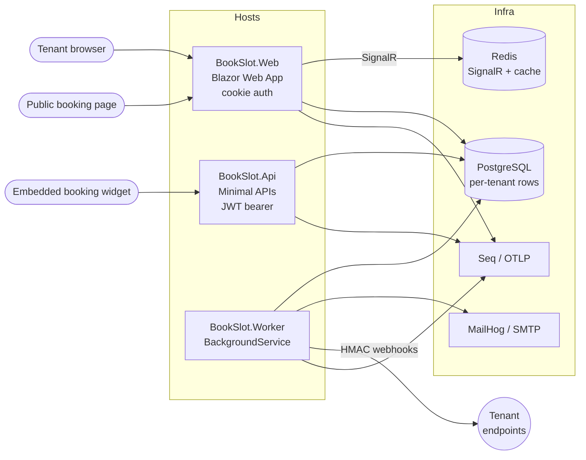

# Architecture

BookSlot is a multi-tenant SaaS for appointment booking. The codebase is organized as **Vertical Slice Architecture (VSA)** on top of a small Domain layer and a single Infrastructure project.

## Runtime topology



## Slice anatomy

Each use-case is a folder under `src/BookSlot.Features/Features/<Area>/<Operation>/` containing:

```
Bookings/
└── CreateBooking/
    ├── CreateBooking.cs           // Endpoints (static), Command/Response DTOs
    ├── CreateBookingHandler.cs    // sealed Handler — calls Domain + DbContext
    └── CreateBookingValidator.cs  // FluentValidation
```

### Slice rules (enforced by `BookSlot.ArchitectureTests`)

1. A slice never depends on another slice. Cross-cutting code lives under `BookSlot.Features.Shared/`.
2. `*Endpoints` classes are static (minimal-API registration helpers).
3. `*Handler` classes are sealed (no inheritance across slices).
4. Domain has no compile-time dependency on EF Core, ASP.NET Core, Infrastructure, Features or any host project.
5. Features must not depend on `Api`/`Web`/`Worker` host projects.
6. Infrastructure must not depend on hosts or feature slices.

Failures in `LayeringTests`, `SliceIsolationTests`, `NamingConventionTests` block CI.

## Multi-tenant model

- Each tenant has a stable `TenantId` (Guid).
- Tenant resolution: `BookSlot.Infrastructure.Tenancy.TenantResolutionMiddleware` reads the host header / API key / JWT claim and sets `ITenantContext.TenantId` for the request scope.
- All `ITenantScoped` entities are filtered via EF Core global query filters so a missing `Where(x => x.TenantId == ...)` cannot leak data.
- The endpoint-level `RequireTenantFilter` rejects requests that reach a tenant-scoped slice without a resolved tenant.

## Authentication & authorization

- **API**: JWT bearer (HS256). Access tokens short-lived, refresh tokens persisted (`RefreshTokens` table) and revocable. Login / refresh / password-reset endpoints are throttled by the `auth-sensitive` rate-limit policy (5/min/IP).
- **Web**: ASP.NET Core Identity cookie + antiforgery + HSTS. Lockout after 5 failed attempts for 15 minutes. Roles: `Admin`, `Owner`, `Staff`.
- **Embed widget / public booking**: anonymous, throttled by `bookings-public` (10/min/IP).

## Background jobs (Worker)

- `OutboxDispatcherJob` — drains the transactional outbox into integration handlers.
- `ReminderJob` — scans confirmed bookings and emits reminder emails.
- `WebhookDeliveryJob` — signs payloads with HMAC-SHA256 (`X-BookSlot-Signature: sha256=...`) and retries with exponential backoff.
- `LeaderElectionHostedService` — Postgres advisory lock; only one Worker instance runs scheduled jobs.
- All jobs publish their state to a HealthCheck consumed by `/health/ready`.

## Observability

- **Logs**: Serilog → console + Seq (`http://localhost:8081`). Correlation id added per request via `CorrelationIdMiddleware` and exposed as `X-Correlation-Id`.
- **Traces / metrics**: OpenTelemetry → OTLP. In dev, points at Seq's OTLP HTTP ingest (`http://localhost:5341/ingest/otlp`).
- **Health**: `/health/live` (process up), `/health/ready` (DB + Redis + outbox lag + leader election), `/health` (full).

## Security hardening (Phase 32)

- `SecurityHeadersMiddleware` — Blazor-friendly CSP, `X-Frame-Options: DENY`, `Referrer-Policy`, `Permissions-Policy`, COOP/CORP.
- `CorsExtensions` — explicit allow-list policy `BookSlotDefault` from `Cors:AllowedOrigins`; dev fallback for any localhost origin.
- `ProductionSecretsValidator` — fail-fast hosted service: refuses to boot Production if `JwtOptions.SigningKey` / `ApiKeyPepper` contains `dev-` / `change-me` / `placeholder` markers, or signing key shorter than 32 chars.
